# Clínica Online

## Descripción
Esta aplicación permite a una clínica online gestionar turnos y usuarios de manera eficiente. La aplicación cuenta con diferentes roles de usuario (admin, paciente, especialista) y ofrece acceso y funcionalidades específicas en función del rol. Entre las funcionalidades disponibles se encuentran la creación y gestión de turnos, administración de usuarios y una sección dedicada a estadísticas e informes.

## Información
La construcción de esta aplicación es parte de la materia Laboratorio de Computación IV, de la Universidad Tecnológica Nacional, Facultad Regional Avellaneda. 
 - Alumno: Alejo Martin Carmona.
 - Materia: Laboratorio de Computación IV.
 - Cuatrimestre: 2do Cuatrimestre.
 - Año: 2024.

## Diseño

A continuación se describen las rutas de la aplicación y su funcionalidad:

### 1 - **`path: ''` (Redirección a `/home`)**
**Descripción:** Redirige automáticamente a la ruta `/home` cuando no se especifica ninguna ruta. Permite a los usuarios ingresar a la página principal al acceder a la URL base.

### 2 - **`path: 'home'`**
**Descripción:** Página principal de la aplicación, donde se ofrece una visión general y se da la bienvenida a los usuarios para que puedan registrarse o iniciar sesión. Una vez logueados, los usuarios pueden navegar a diferentes secciones según su rol.
   
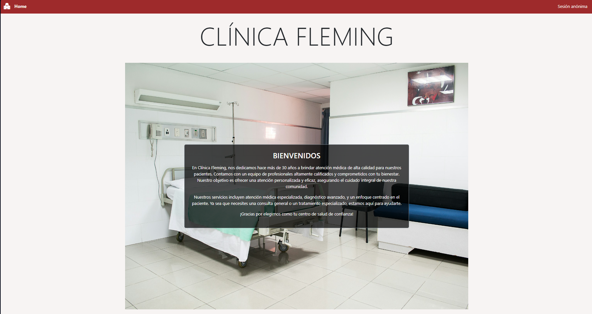

Una vez se inicia sesión, el usuario tiene acceso a las diferentes secciones según su rol. Por ejemplo, esta es la vista de un administrador:

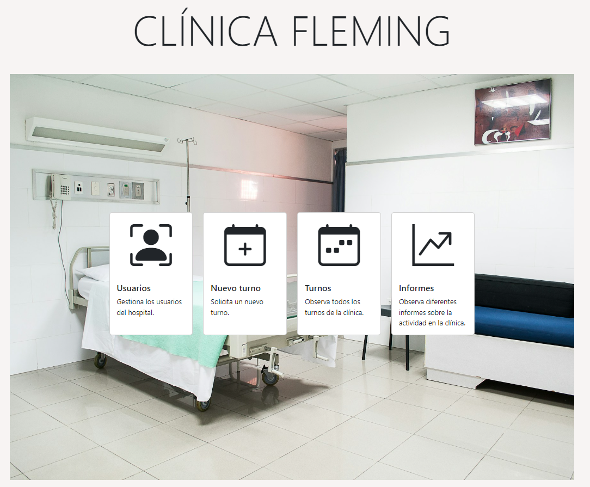

### 3 - **`path: 'registro'`**
**Descripción:** Página de registro donde los usuarios pueden crear una cuenta en la aplicación. Permite seleccionar el tipo de usuario (paciente o especialista) y recoger la información necesaria para el registro.
Se necesita completar un captcha correctamente.

Por ejemplo, este es el proceso de registro para un paciente:

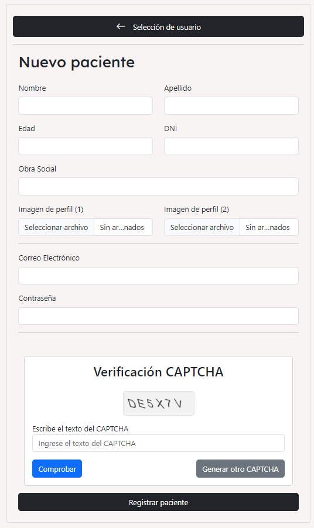

### 4 - **`path: 'login'`**
**Descripción:** Página de inicio de sesión para usuarios registrados. Permite a los usuarios acceder a la aplicación introduciendo sus credenciales. Tiene diferentes botones de acceso rápido para facilitar la prueba de la aplicación.

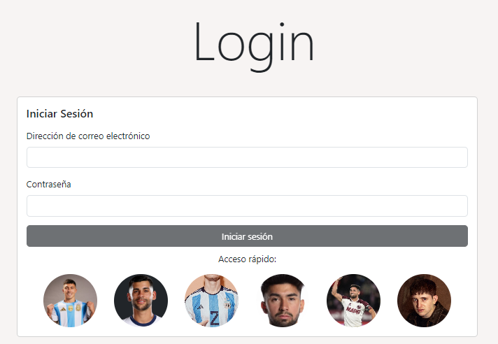

### 5 - **`path: 'usuarios'`** (SOLO PARA ADMINISTRADORES)
**Descripción:** Página de administración de usuarios, accesible solo por administradores. Aquí, los administradores pueden ver y gestionar los usuarios registrados en la aplicación. Pueden habilitar especialistas para que comiencen a trabajar en la clínica y crear nuevos usuarios, incluyendo administradores. La sección además cuenta con la opción de descargar un Excel con la información de todos los usuarios, además de otra donde se pueden descargar los turnos de cada usuario (especialista o paciente), también en formato Excel.

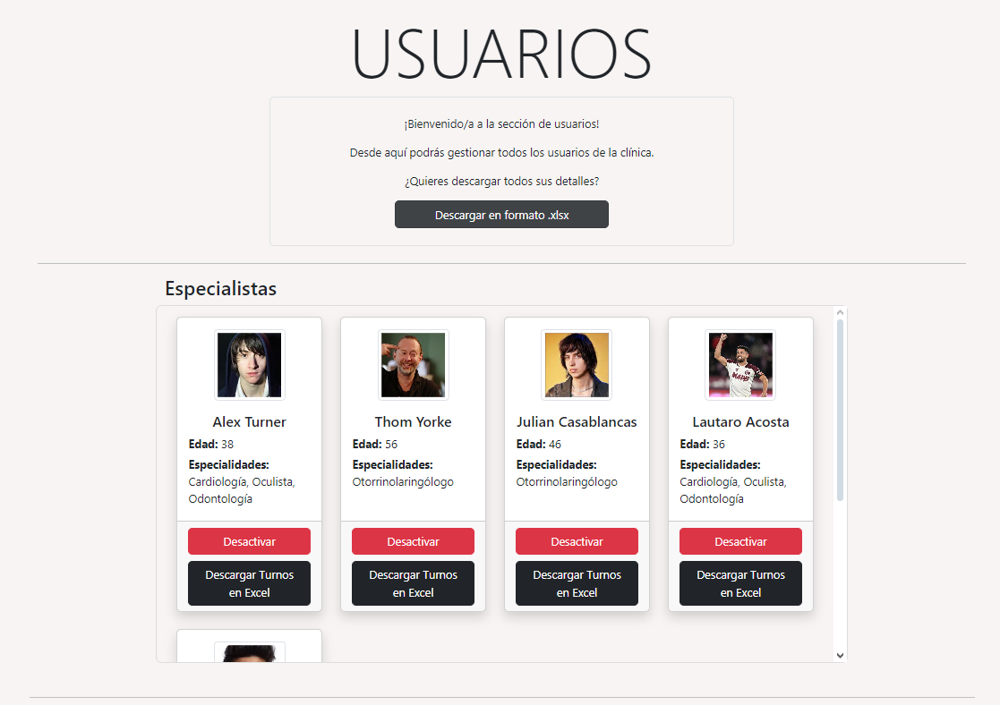

### 6 - **`path: 'nuevo-turno'`** (PARA ADMINISTRADORES Y PACIENTES)
**Descripción:** Página para la creación de nuevos turnos, accesible por administradores y pacientes. Los usuarios pueden programar un turno seleccionando detalles como la fecha, hora y el especialista deseado. Si el turno es creado por un administrador, debe proporcionar también el nombre del paciente.

Al principio, se le pedirá al paciente que escoja un especialista:
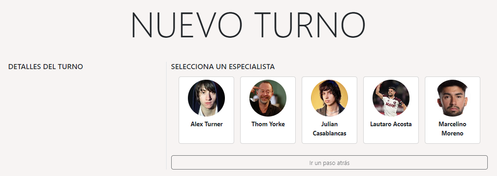

Luego se le mostrarán las especialidades que el especialistra trabaja y tiene configurado sus horarios:
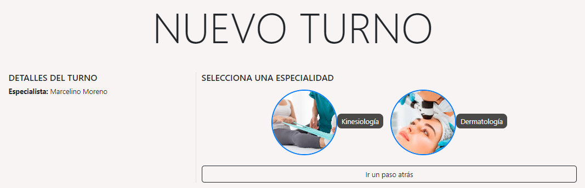

Luego, se le pedirá al paciente que elija un turno de los disponibles (observe que no se puede seleccionar el primer turno de la lista puesto que está ocupado):
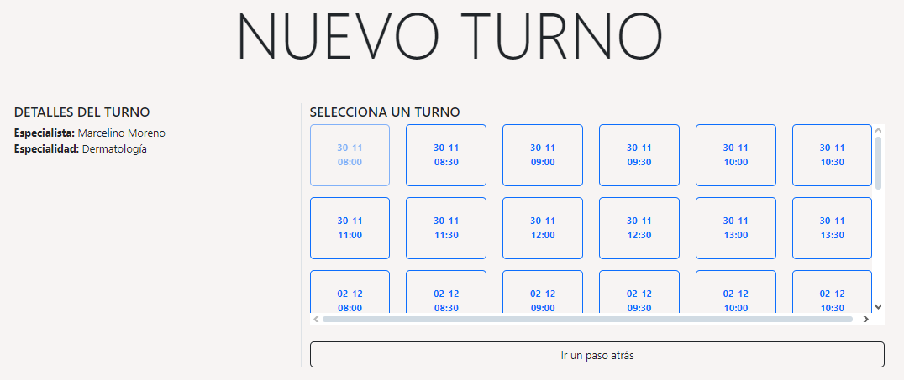

Si el usuario creando el turno es un administrador, se le pedirá que elija el paciente para asignarle el turno:
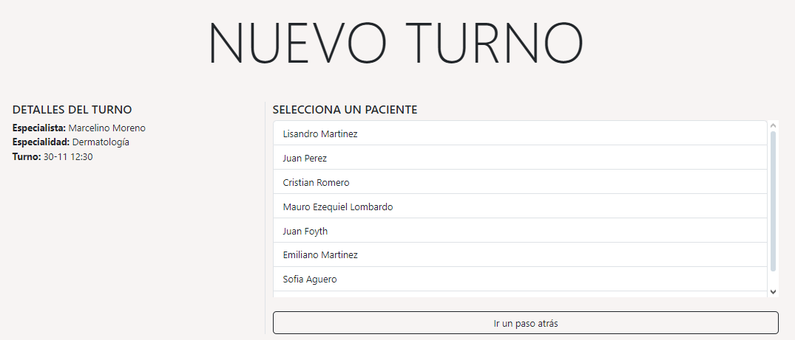

Finalmente, se le muestra una tabla con las opciones elegidas y se le permite al usuario crear el turno.
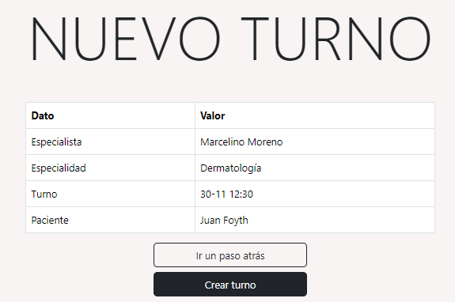

Luego de la creación, se lo redirige a la página principal.

### 7 - **`path: 'mi-perfil'`**
**Descripción:** Página de perfil personal del usuario, accesible para todos los usuarios autenticados. Permite ver y editar la información personal del usuario. En esta sección, el especialista puede modificar la duración de sus turnos y sus días de trabajo.
Si el usuario es de tipo "paciente" podrá no solo ver su historial clínica, sino también descargar todos sus turnos de una especialidad.

"Mi Perfil" para un paciente:
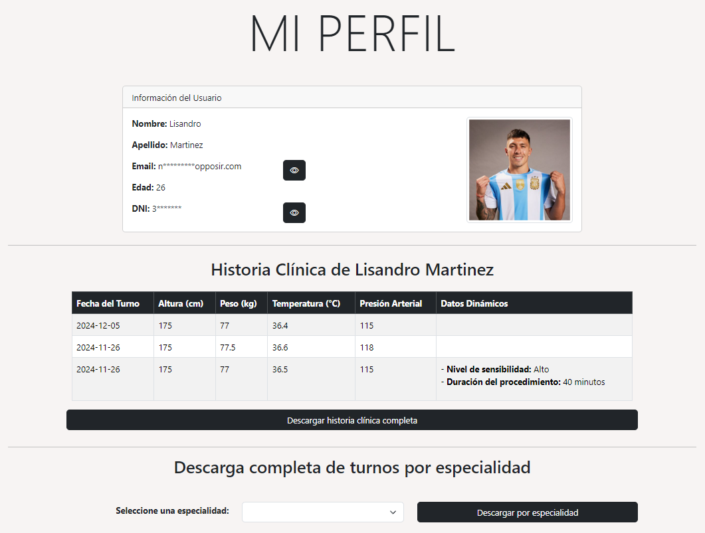

"Mi Perfil" para un especialista:
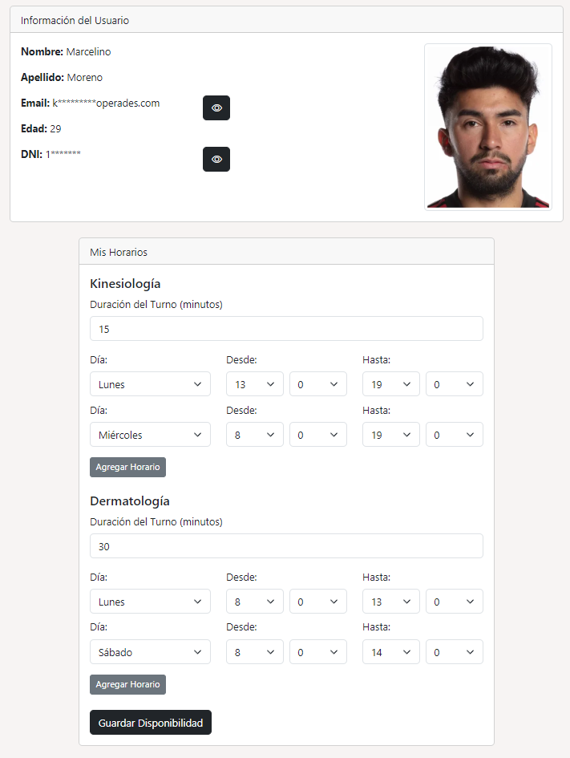

### 8 - **`path: 'mis-turnos'`** (PARA ESPECIALISTAS Y PACIENTES)
**Descripción:** Página de gestión de turnos personales, accesible para especialistas y pacientes. Los usuarios pueden ver sus turnos programados y realizar acciones específicas sobre los mismos. También posee un filtrado sobre los turnos.
   El paciente puede cancelar el turno si aún no fue realizado o calificar su atención mediante una reseña y el completado de una encuesta, una vez que el turno haya finalizado.
   El especialista puede cancelar el turno, rechazarlo o realizarlo, cargando un diagnóstico y comentario sobre el mismo. Además, agrega el historial clínico cuando finaliza el tunro.

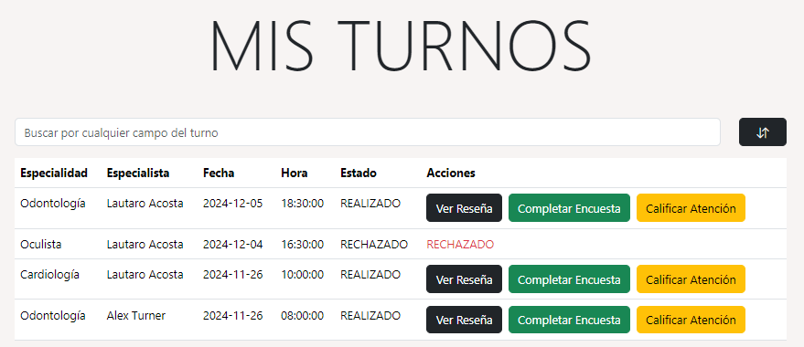

### 9 - **`path: 'turnos'`** (SOLO PARA ADMINISTRADORES)
**Descripción:** Página de administración de todos los turnos de la clínica, accesible únicamente para administradores. Aquí, los administradores pueden ver todos los turnos registrados, aplicar filtros sobre los mismos y cancelar los que considere.

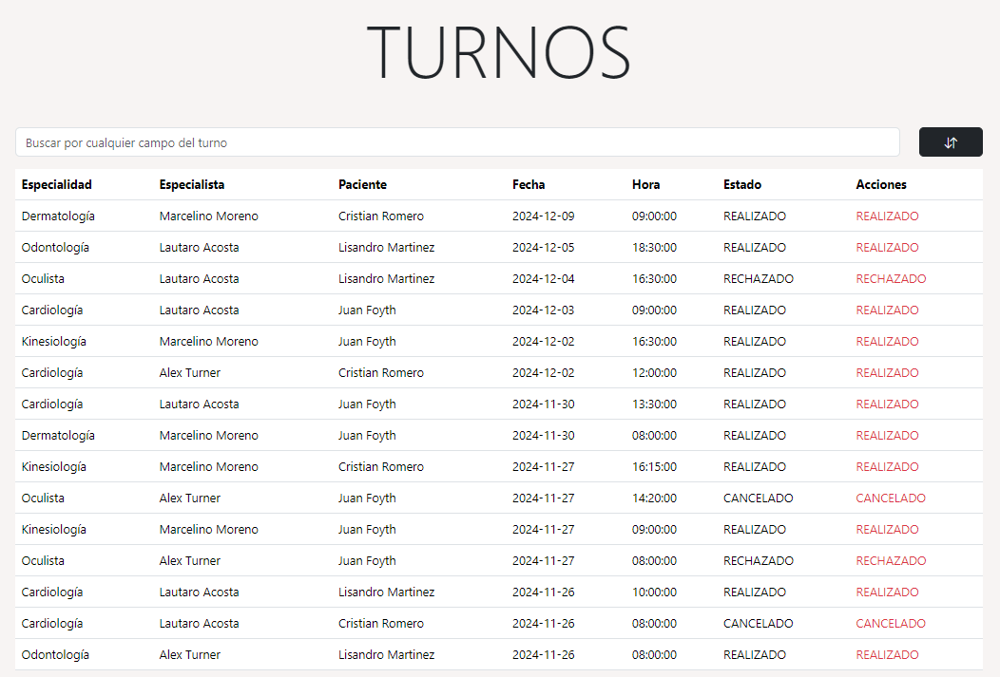 

### 10 - **`path: 'pacientes'`** (SOLO PARA ESPECIALISTAS)
**Descripción:** Página solo para especialistas que les permite observar a todos los pacientes que han atendido por lo menos una vez. Además, se les permite acceder a las historias clínicas de sus últimos 3 turnos y a su historia clínica completa, si es que lo necesita.

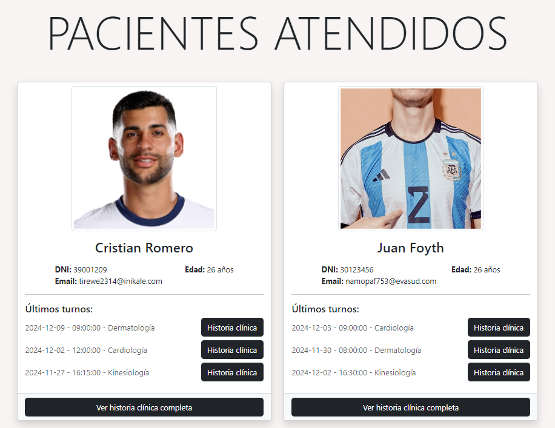 

### 11 - **`path: 'informes'`** (SOLO PARA ADMINISTRADORES)
**Descripción:** Página solo para administradores que les permite observar diferentes informes y gráficos acerca de la actividad de la clínica.

#### Informes incluídos:
- Log de ingresos al sistema. Indicando el usuario, día y horario que ingreso al sistema.
- Cantidad de turnos por especialidad.
- Cantidad de turnos por día.
- Cantidad de turnos solicitado por médico en un lapso de tiempo.
- Cantidad de turnos finalizados por médico en un lapso de tiempo.

Además, se le permite descargar la información en un archivo pdf si es que el administrador lo requiere.

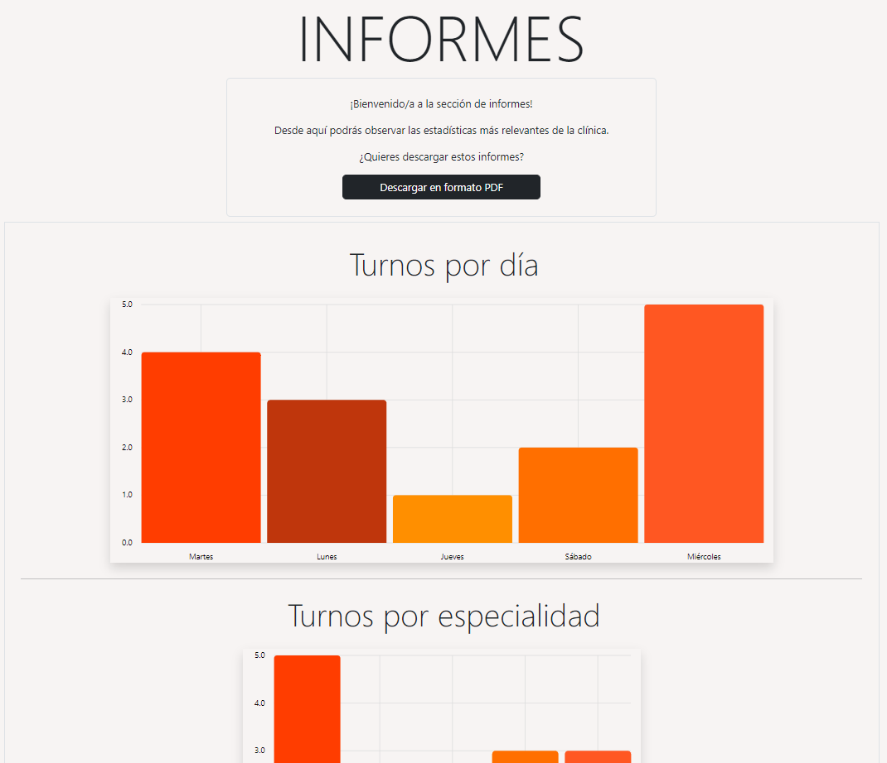 